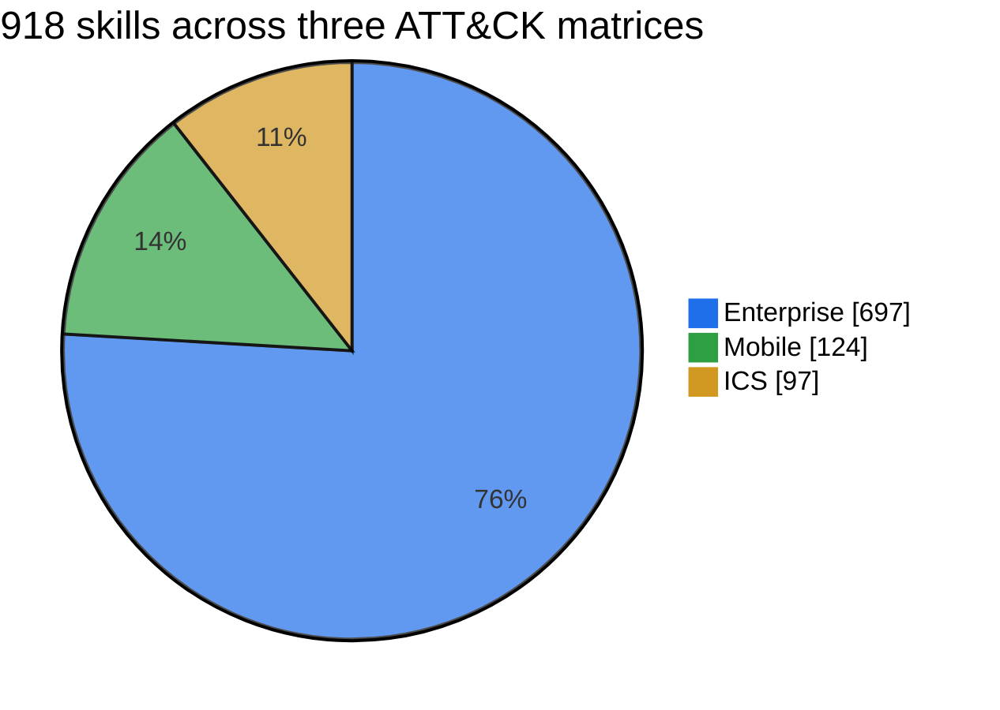

# MITRE ATT&CK Agent Skills


This package contains one Agent Skill per non-revoked, non-deprecated [MITRE ATT&CK](https://attack.mitre.org/) `attack-pattern` object from the latest [MITRE ATT&CK STIX bundles](https://attack.mitre.org/resources/attack-data-and-tools/#access-attack) in `mitre-attack/attack-stix-data`.

## Counts



| Domain     | Techniques | Sub-techniques |     Total |
| ---------- | ---------: | -------------: | --------: |
| Enterprise |        222 |            475 |       697 |
| Mobile     |         77 |             47 |       124 |
| ICS        |         79 |             18 |        97 |
| **Total**  |    **378** |        **540** |   **918** |

## Layout

```text
mitre-attack-agent-skills/
├── enterprise/
├── mobile/
├── ics/
├── manifest.csv
├── manifest.json
├── validation-summary.txt
└── README.md
```

Each skill directory contains a `SKILL.md` file whose frontmatter name matches the directory name and whose description includes ATT&CK ID, technique name, domain, and defensive use cases. Each skill also bundles technique-specific resources under `references/`, `templates/`, `scripts/`, and `assets/`.

## Notes

- Skill names use the pattern `attack-<domain-code>-<technique-id>-<technique-slug>`.
- Domain codes are `ent`, `mob`, and `ics`.
- Every skill includes:
  - `references/technique-profile.json`
  - `references/detection-and-mitigation.md`
  - `references/known-threat-context.md`
  - `templates/detection-brief.md`
  - `templates/hunt-plan.md`
  - `templates/incident-response-note.md`
  - `templates/coverage-assessment.md`
  - `scripts/render_brief.py`
  - `assets/output-schema.json`
- ATT&CK-derived content is subject to MITRE ATT&CK Terms of Use: https://attack.mitre.org/resources/terms-of-use/
- These skills are intentionally defensive. They guide triage, detection engineering, hunting, mitigation, coverage assessment, incident response, and safe authorized validation without providing malware or unauthorized exploitation instructions.
